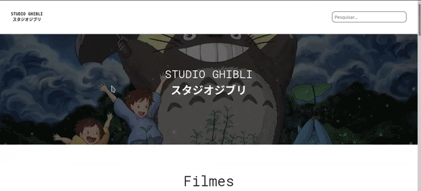

# GhibliAppAngular

Primeiro projeto pessoal em angular. básicamente um Front-End usando a [API do Estudio Ghibli](ghibliapi.herokuapp.com/)

#### Demonstração:



## Instalando

Clone o repositório e use o comando:

```bash
npm install
```

## Rodando o Projeto

use o comando:

```bash
ng serve
```

## Licença

[MIT](https://choosealicense.com/licenses/mit/)